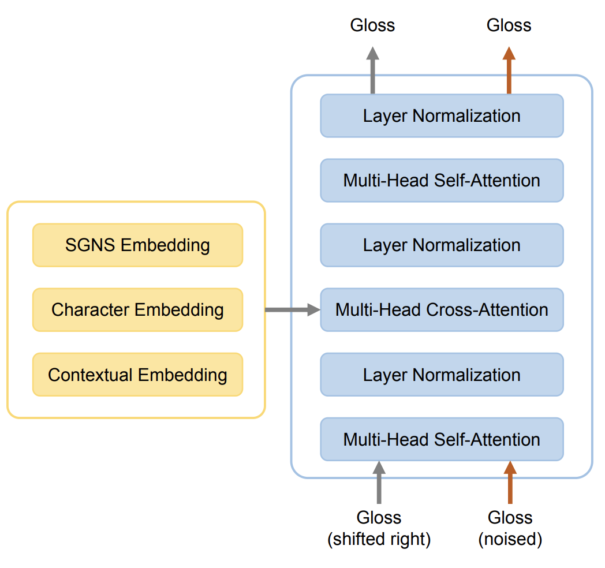

## Overview

This repository contains the source code for the models used for _BLCU-ICALL_ team's submission
for [Task 1: CODWOE - COmparing Dictionaries and WOrd Embeddings](https://competitions.codalab.org/competitions/34022). The model is
described in the paper
["BLCU-ICALL at SemEval-2022 Task 1: Cross-Attention Multitasking Framework for Definition Modeling"]()
.

Citation:

```bibtex
@inproceedings{kong-etal-2022-semeval,
    title={BLCU-ICALL at SemEval-2022 Task 1: Cross-Attention Multitasking Framework for Definition Modeling},
    author={Kong, Cunliang and 
            Wang, Yujie and 
            Chong, Ruining and 
            Yang, Liner and 
            Zhang, Hengyuan and 
            Yang, Erhong and 
            Huang, Yaping},
    booktitle={Proceedings of the 16th International Workshop on Semantic Evaluation (SemEval-2022)}
    year={2022},
    publisher={Association for Computational Linguistics},
}
```

## Architecture


**Notes**

* If what you are interested in the source code for the model then just see
  [src/model.py](https://github.com/blcuicall/SemEval2022-Task1-DM/blob/main/src/model.py)
  .

## Prerequisites

#### 1 - Install Requirements

- python >= 3.7
- pytorch >= 1.8
- transformers >= 4.17.0
- tokenizers >= 0.11.6
- tqdm >= 4.63.1

#### 2 - Download CoDWoE Data

Data provided by the competition organizers can be found here:

- [CoDWoE Data Repository](https://codwoe.atilf.fr/)

Place the file(s) anywhere you like, and modify `DATA_DIR` in the provided shell scripts for training and testing.

## Execution

#### Training

Simply use `train.sh` by:

```shell
./train.sh
```

#### Testing

Similarly, use `test-{lang}.sh`. English for example:

```shell
./test-en.sh
```
